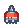
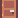

# Platformer
Our webGL link (https://andrewz421.itch.io/platformer?secret=ZjMS9U9jRyuSOcGj7hYKosIZtO4).

## Group members:
Andrew Zhao  
Yifan Huang  
Yinuo Chen

## 1. Introduction
A level-based game where players must navigate obstacles (jump over obstacles, avoid enemies...) to guide the character to the finish line within a certain time.

### 1.1 Core Loop
- Input - Player input from keyboard, to control the character (e.g., move left, move right, jump).
- Action - The character responds to player input by moving, jumping, or performing other actions.
- Obstacle - The game world is filled with various obstacles and challenges, such as platforms, pits, spikes, and lava. These obstacles pose threats to the character and require the player to navigate and overcome them.
- Goal - Pass the level within the allotted time

### 1.2 Resource Links
- Pixel Platformer (https://www.kenney.nl/assets/pixel-platformer)
- Pixel Platformer Industrial Expansion (https://www.kenney.nl/assets/pixel-platformer-industrial-expansion)

## 2. Gameplay Description

### 2.1 Operation
- Use the A key to move the character left.
- Use the D key to move the character right.
- Press Q to make the character get bigger or smaller. the bigger character jumps higher.
- Press the spacebar to make the character jump. Press the spacebar twice to double jump.
- Clicking the left mouse button to fire when you have bullets.
- Press Esc to open the game menu.

### 2.2 Objects in the game
- : This is a flying monster. It will fly up and down. The character cannot touch the monster. Otherwise the player' HP will be decreased by 1.
- : This is a motionless monster. It will 
stay where it is. The character cannot touch the monster. Otherwise the player' HP will be decreased by 1.
-  : This is an ammunition box. The character will get five bullets by touching this box.
-  : This is a bullet. The character can fire bullets forward by clicking the left mouse button.
-  : This is a key. The character needs to get a key to open the exit.
-  : This is the exit. The character needs to get here to pass the level.
-  : This is the water. The character needs to jump over it, otherwise you will drop through it.
-  : This is the HP replenishing prop. The character's HP will be increased by 1 if the character's HP is below the initial value.